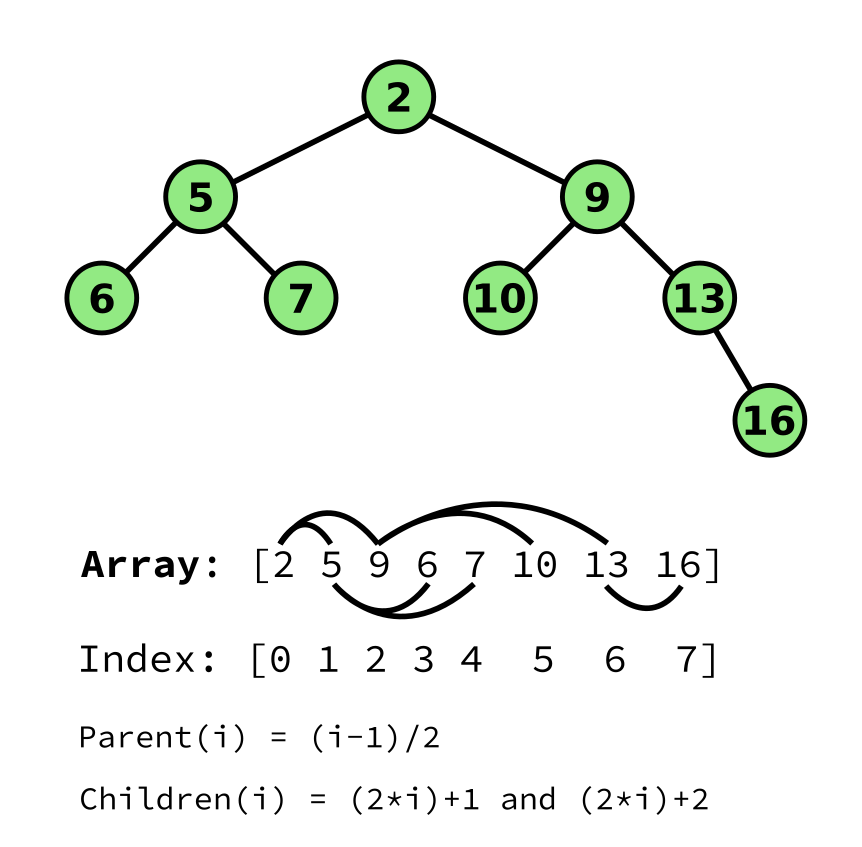

<h1 align="center">Go Priority Queue 🚥</h1>
<p align="center">An efficient min and max priority queue using a binary heap encoded in an array.</p>
<p align="center">
   <a href="https://github.com/fgrosse/prioqueue/releases"></a>
   <a href="https://github.com/fgrosse/prioqueue/actions/workflows/ci.yml"></a>
   <a href="https://goreportcard.com/report/github.com/fgrosse/prioqueue"></a>
   <!-- <a href="https://codecov.io/gh/fgrosse/prioqueue"></a> -->
    <a href="https://pkg.go.dev/github.com/fgrosse/prioqueue"></a>
    <a href="https://github.com/fgrosse/prioqueue/blob/master/LICENSE"></a>
</p>

---

Package `prioqueue` implements an efficient min and max priority queue using a
binary heap encoded in a slice.   

## Example usage

[embedmd]:# (example_test.go)
```go
package prioqueue_test

import (
	"fmt"
	"math/rand"

	"github.com/fgrosse/prioqueue"
)

func Example() {
	// The queue will be backed by a slice and knowing its size ahead of time
	// avoids unnecessary allocations. If you don't know in advance how many
	// items you want to push then you can set n to 0 or a negative number
	// instead. In this case the slice used by the queue will start with the
	// default slice capacity of Go.
	n := 10

	// We use a random number generator in this example to generate values.
	rng := rand.New(rand.NewSource(42))

	q := prioqueue.NewMaxHeap(n)
	for i := 0; i < n; i++ {
		// Every element we push and pop from the queue must have a unique identifier.
		// It is the callers responsibility to ensure this uniqueness.
		id := uint32(i)
		prio := rng.Float32()
		q.Push(id, prio)
	}

	// The queue will always return the highest priority element first.
	for q.Len() > 0 {
		id, prio := q.Pop()
		fmt.Printf("%.2f (id %d)\n", prio, id)
	}

	// Output:
	// 0.81 (id 6)
	// 0.65 (id 9)
	// 0.60 (id 2)
	// 0.38 (id 7)
	// 0.38 (id 5)
	// 0.38 (id 8)
	// 0.37 (id 0)
	// 0.21 (id 3)
	// 0.07 (id 1)
	// 0.04 (id 4)
}
```

## How it works

One way to implement a priority queue is by using a _binary heap_. Such a heap
can be visualized as a binary tree in which each node's value is smaller than
the values of its children ("Min Heap"). Alternatively the value can be _greater_
than all of its children ("Max Heap") as long as this property is applied
consistently upon the tree. For the remaining description we will assume a _Min_
heap.

Now to get the smallest value we can get it in constant time from the root of
the tree. To add a new value (aka "push") we append it to one of the leaves of
the tree and then "bubble" it up by swapping the inserted node with its
parent until the heap property is satisfied again. Since we have a binary tree
all the time, the time complexity of insertion is logarithmic. Removing the
minimum element (aka "pop") can also be done in logarithmic time. To do this we
remove the root node and replace it with one of the leave nodes. We then swap
the new root node down until the heap property is satisfied again (i.e. all
nodes must have smaller values than their children). 

Such a binary tree can be encoded into an _array_ where the root node is the
first element. We then write all children on the same level one after another
to the array until it contains all _n_ nodes of tree. With this schema, the
parent of node _i_ will be at index _(i-1)/2_, and the children of _i_ are found
at indices _(2*i)+1_ and _(2*i)+2_ respectively.

The nice thing about encoding this in an array is that it is very space efficient
without sacrificing any speed. Especially in Go, we can leverage the concept of
slices, for instance by pre allocating the underlying array and re-slicing it
when pushing and popping element. That is also what the standard library is doing
in the `container/heap` implementation. However, the implementation here appears
to be slightly faster, probably because it is working on a concrete scalar data
type directly (i.e. `float32`) instead of having to go through an interface.



## Benchmarks

This package provides a couple of benchmarks to understand the performance of
the implementation. In order to compare it with a baseline, there is also a
benchmark which uses the `container/heap` package from the standard library.

There are three different benchmarks that test the performance of the standard
library implementation (`BenchmarkStdlib*`) and this package (`BenchmarkMaxHeap*`).

The `*Push1*` benchmarks pushing a single element onto the queue and with each
iteration of this benchmark the queue is growing. The `*Push200*` benchmarks
test how long it takes to push exactly 200 elements. Having a benchmark with a
fixed amount of elements to push (and thus a fixed size for the resulting queue)
is useful because it shows performance of a smaller queue (i.e. only 200 elements).
In contrast, the `*Push1*` benchmarks show performance with queues which contain
millions of elements. The `*Empty` vs `*Preallocate` variants test performance
when the corresponding queue is not sized in advance (i.e. "Empty") vs allocating
the memory for the queue in advance (i.e. "Preallocate").

Finally, the `*Pop200*` benchmarks test how long it takes to pop all elements
from a queue which contains out of 200 elements.

```shell
$ go test -bench .
goos: linux
goarch: amd64
pkg: github.com/fgrosse/prioqueue
cpu: Intel(R) Core(TM) i7-8550U CPU @ 1.80GHz
BenchmarkMaxHeap_Push1_Empty-8               11827210     93.54 ns/op       52 B/op       1 allocs/op
BenchmarkMaxHeap_Push1_Preallocate-8         30413618     37.83 ns/op        8 B/op       1 allocs/op
BenchmarkMaxHeap_Push200_Empty-8               140348      8185 ns/op     5688 B/op     209 allocs/op
BenchmarkMaxHeap_Push200_Preallocate-8         223698      5389 ns/op     1600 B/op     200 allocs/op
BenchmarkMaxHeap_Pop200-8                      193807      6115 ns/op        0 B/op       0 allocs/op

BenchmarkStdlib_Push1_Empty-8                10242606     98.41 ns/op       49 B/op       1 allocs/op
BenchmarkStdlib_Push1_Preallocate-8          21231261     50.39 ns/op        8 B/op       1 allocs/op
BenchmarkStdlib_Push200_Empty-8                 97664     12617 ns/op     5688 B/op     209 allocs/op
BenchmarkStdlib_Push200_Preallocate-8          117884      9834 ns/op     1600 B/op     200 allocs/op
BenchmarkStdlibHeap_Pop200-8                    59112     20256 ns/op        0 B/op       0 allocs/op
PASS
ok      github.com/fgrosse/prioqueue    30.705s
```
